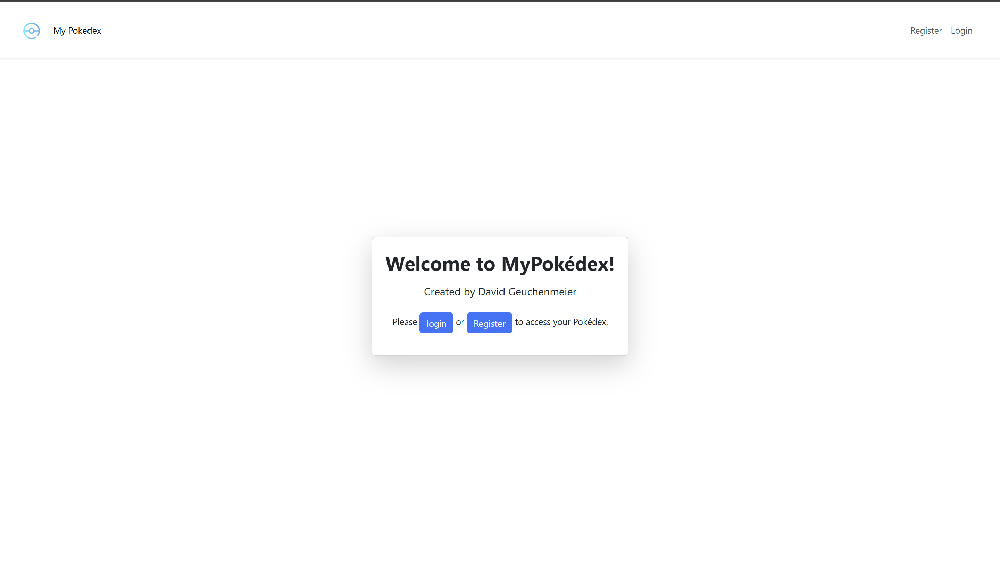
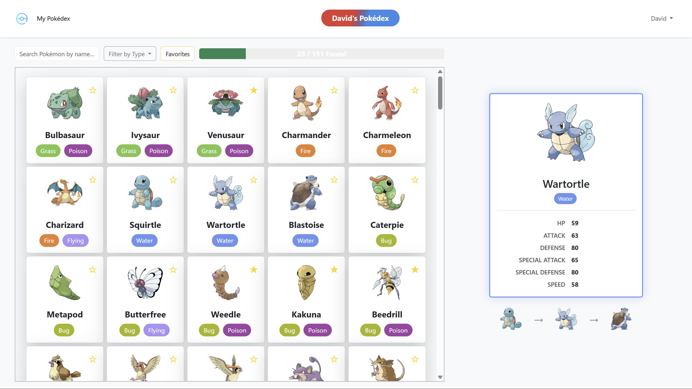

# MyPokédex

A web-based Pokédex for the original 151 Pokémon, built with Laravel, Bootstrap, and PokéAPI. Users can register, log in, favorite Pokémon, and track which Pokémon they've found. Progress is shown with a dynamic progress bar, and all data is stored per user.

> **Note:** This repository is public for viewing only. Contributions are not accepted.

# Screenshots
Below are screenshots of the MyPokédex application:

## Welcome Screen


## Main Pokédex Screen


## Features
- Display the original 151 Pokémon with images and types
- User registration and login
- Favorite Pokémon (per user)
- Mark Pokémon as "found" (per user)
- Progress bar showing found count
- Filter and search by name and type
- View Pokémon details and evolution chain
- Responsive, modern UI with Bootstrap
- Data stored in SQLite or MySQL

## Getting Started

### Prerequisites
- PHP >= 8.1
- Composer
- Node.js & npm
- SQLite (default) or MySQL

### Installation
1. **Clone the repository:**
   ```sh
   git clone https://github.com/IDavidGI/MyPokedex.git
   cd MyPokedex
   ```
2. **Install PHP dependencies:**
   ```sh
   composer install
   ```
3. **Install JS dependencies:**
   ```sh
   npm install
   ```
4. **Copy and edit environment file:**
   ```sh
   cp .env.example .env
   # Edit .env for your database (default is SQLite)
   ```
5. **Generate app key:**
   ```sh
   php artisan key:generate
   ```
6. **Run migrations:**
   ```sh
   php artisan migrate
   ```
7. **Build frontend assets:**
   ```sh
   npm run build
   ```
8. **Start the server:**
   ```sh
   php artisan serve
   ```

## Usage
- Register or log in to access your personal Pokédex.
- Click a Pokémon to view details and mark it as found.
- Favorite Pokémon by clicking the star icon.
- Use the search and filter options to find Pokémon by name or type.
- Progress bar updates as you find more Pokémon.

## Tech Stack
- **Backend:** Laravel
- **Frontend:** Blade, Bootstrap, JavaScript
- **Database:** SQLite (default), MySQL supported
- **API:** PokéAPI

## Deployment
- Can be deployed to platforms like Heroku, Render.com, or any PHP hosting.
- For SQLite, no extra setup needed. For MySQL, update `.env` accordingly.

## License
MIT

## Credits
- [PokéAPI](https://pokeapi.co/) for Pokémon data
- Bootstrap for UI
- Laravel for backend

---
Created by David Geuchenmeier
